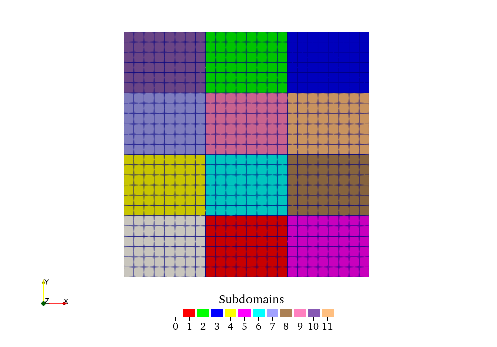
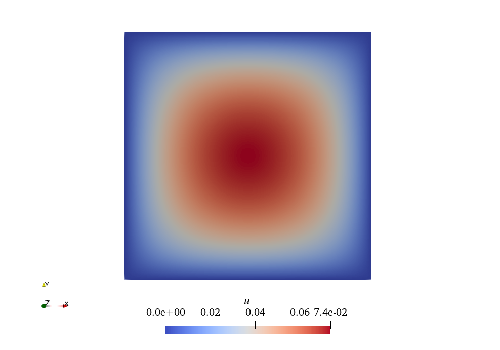

# Toy FETI-DP example
### A simple implementation of FETI-DP using FEniCSx for a Poisson problem with homogeneous Dirichlet conditions.

This project solves the Poisson problem
```math
\displaylines{\Delta u + 1 = 0\quad\text{in }\Omega \\u = 0\quad\text{on }\partial\Omega}
```
with $\Omega=[0,1]\times[0,1]$ using finite elements and a simple (non preconditioned) FETI-DP implemention in Python based on the [FEniCSx](https://fenicsproject.org/documentation/) library.

The domain $\Omega$ is subdivided into $N_x\times N_y$ subdomains, each of them discretized with $n_x\times n_y$ elements and degree $p$.


 

## Implementation details

* The (exact) FETI-DP solver was firstly introduced in [[1]](#1) but this project implementation follows closely the notation used in Section 2.2 of [[2]](#2).

* Even if DOLFINx assembles and solves the problem using PETSc matrices and vectors, the present implementation transforms those in the [scipy sparse CSR matrix](https://docs.scipy.org/doc/scipy/reference/generated/scipy.sparse.csr_matrix.html) and [numpy arrays](https://numpy.org/doc/stable/reference/generated/numpy.array.html), respectively.

* The implementation assumes that all the subdomains are equal, and therefore, subdomain related quantities are computed for only one subdomain.

* Beyond the FETI-DP implementation, a single domain implementation is provided in the file `monolithic.py`.

## Installation

This project can be run using a modern version of Python 3, the version 0.8.0 of the [DOLFINx](https://github.com/FEniCS/dolfinx) library and the [scipy](https://scipy.org) library, by simply typing
```
python3 test.py
```

The required dependencies can be easily installed using [conda](https://conda.io/projects/conda/en/latest/user-guide/install/index.html) and the provided `environment.yml` as:
```
conda env create -f environment.yml
```

## Documentation
There is no built documentation for this project. However, the project is relatively simple and every single function is properly documented.

# INTERVIEW TEST

This repository is missing some functions and implementations, so it doesn't work.
Your task is to implement the missing parts for making it work.
You will find commented code as well as exceptions as
```
raise ValueError("Not implemented!")
```
in different functions of the files `fetidp.py`, `subdomain.py`, and `global_dofs_manager.py`.

To check if your implementation is working correctly, you can compare your solution with the one obtained with the monolithic solver in `monolithic.py`. See also the image above for a reference on how the solution looks like.

You can visualize the obtained solution by importing the `*.pb` folders from a (relatively) modern version of [ParaView](https://www.paraview.org).

A few comments:
* You don't need to use the provided functions. They are just a template for helping you, but feel free to do your own implementation if you wish.
* I don't expect you to parallelize the code or optimize it to squeeze every single FLOP in your computer. However, good efficient code is always welcome.
* You don't need to use PETSc library for matrices and vectors. You can stick to scipy sparse CSR matrices and numpy arrays for the vectors.


## Bonus
If you liked the project and want to go further, possible improvements are:
* Implement a preconditioner (see [[1]](#1)) and solve the preconditioned system $F \lambda = \bar{d}$ using a Conjugate Gradient solver.
* Study the condition number of the matrix $F$ and number of iterations of the CG solver and analyze it in the light of the theory in [[1]](#1).
* Extend the implementation to other boundary conditions and/or source terms.
## References
<a id="1">[1]</a> 
Farhat, C., Lesoinne, M., LeTallec, P., Pierson, K., & Rixen, D. (2001).
FETI‐DP: a dual–primal unified FETI method—part I: A faster alternative to the two‐level FETI method.
International journal for numerical methods in engineering, 50(7), 1523-1544.
https://web.stanford.edu/group/fpc/Publications/FETI.pdf

<a id="2">[2]</a> 
Hirschler, T., Bouclier, R., Antolin, P., & Buffa, A. (2024).
Reduced order modeling based inexact FETI‐DP solver for lattice structures.
International Journal for Numerical Methods in Engineering, 125(8), e7419.
https://arxiv.org/pdf/2308.11371

 
## Credits
 
Pablo Antolin (pablo.antolin AT epfl DOT ch)
 
## License
 
The MIT License (MIT)

Copyright (c) 2024 Pablo Antolin

Permission is hereby granted, free of charge, to any person obtaining a copy of this software and associated documentation files (the "Software"), to deal in the Software without restriction, including without limitation the rights to use, copy, modify, merge, publish, distribute, sublicense, and/or sell copies of the Software, and to permit persons to whom the Software is furnished to do so, subject to the following conditions:

The above copyright notice and this permission notice shall be included in all copies or substantial portions of the Software.

THE SOFTWARE IS PROVIDED "AS IS", WITHOUT WARRANTY OF ANY KIND, EXPRESS OR IMPLIED, INCLUDING BUT NOT LIMITED TO THE WARRANTIES OF MERCHANTABILITY, FITNESS FOR A PARTICULAR PURPOSE AND NONINFRINGEMENT. IN NO EVENT SHALL THE AUTHORS OR COPYRIGHT HOLDERS BE LIABLE FOR ANY CLAIM, DAMAGES OR OTHER LIABILITY, WHETHER IN AN ACTION OF CONTRACT, TORT OR OTHERWISE, ARISING FROM, OUT OF OR IN CONNECTION WITH THE SOFTWARE OR THE USE OR OTHER DEALINGS IN THE SOFTWARE.
